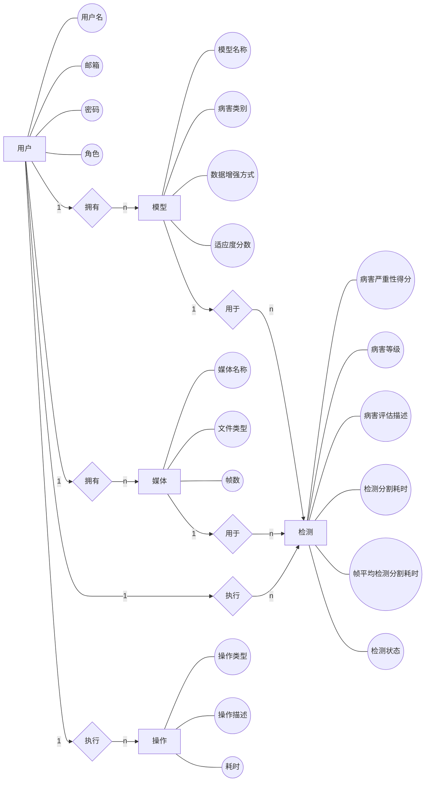

# 桥梁病害检测系统传统ER图

## 实体说明

### 用户 (User)
- 存储用户的基本信息，包括用户名、邮箱、密码等
- 用户角色分为管理员(ADMIN)、开发者(DEVELOPER)和普通用户(USER)
- 用户状态包括活跃(ACTIVE)、非活跃(INACTIVE)和禁用(BANNED)

### 模型 (Model)
- 存储不同训练模型的基本信息和性能评估指标
- 包含模型名称、存储路径、病害类别、数据增强方式等
- 记录模型的性能指标，如精度、召回率、F1分数等

### 媒体 (Media)
- 存储与用户相关联的媒体文件信息
- 包含文件名、路径、类型、分辨率等
- 媒体可以是图片或视频

### 检测 (Detection)
- 每条记录对应一次检测任务
- 包含检测结果路径及相关统计信息
- 记录病害数量、面积、形状复杂度等评估指标
- 任务状态包括待处理(PENDING)、处理中(IN_PROGRESS)、已完成(COMPLETED)和失败(FAILED)

### 操作 (Operation)
- 记录系统中的各种操作，用于审计和监控
- 包含操作类型、描述、耗时、状态等
- 操作类型包括认证(AUTHENTICATE)、创建(CREATE)、读取(READ)、更新(UPDATE)和删除(DELETE)
- 操作状态包括成功(SUCCESS)和失败(FAILURE)