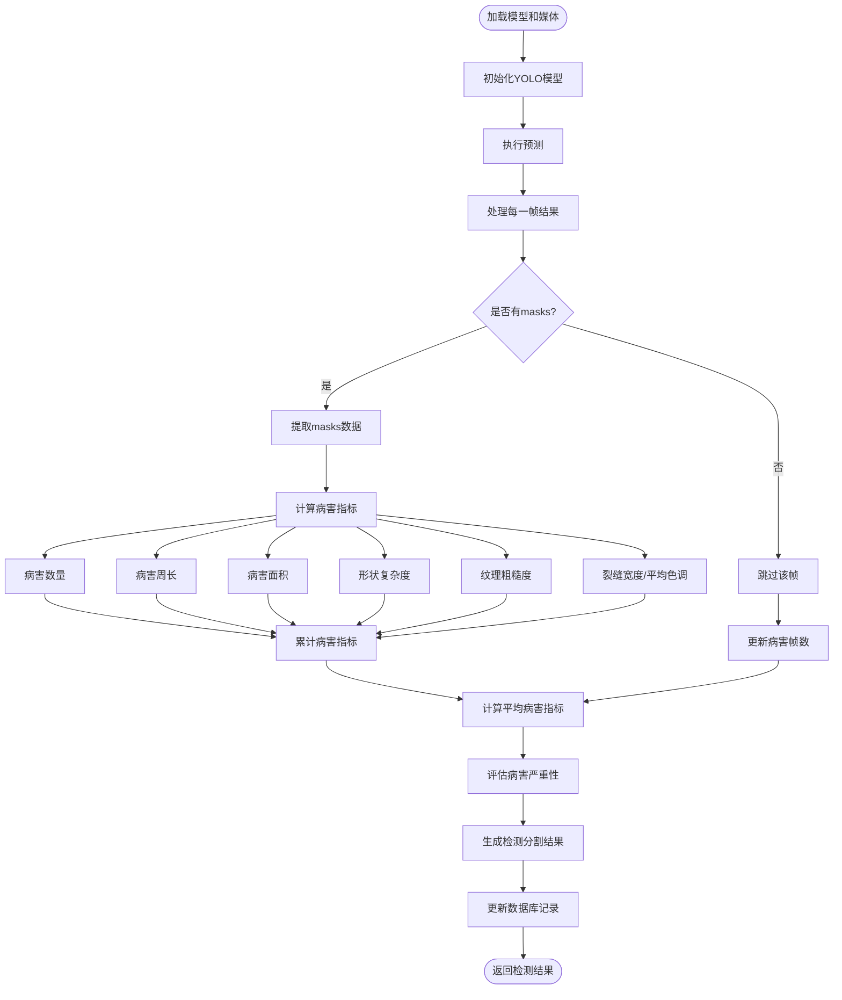

# 桥梁病害检测分割算法流程图

以下流程图展示了桥梁病害检测分割算法的核心流程，从加载模型和媒体开始，直至生成检测结果。

## 流程说明

1. **加载模型和媒体**：从数据库获取模型和媒体信息，并加载相应文件
2. **初始化YOLO模型**：使用加载的模型文件初始化YOLO模型
3. **执行预测**：对媒体文件执行YOLO预测
4. **处理每一帧结果**：逐帧处理YOLO预测结果
5. **检查masks**：判断当前帧是否检测到病害
6. **提取masks数据**：从检测结果中提取masks数据
7. **计算病害指标**：计算各种病害指标（数量、周长、面积等）
8. **累计病害指标**：累加各帧的病害指标
9. **计算平均病害指标**：计算所有帧的平均病害指标
10. **评估病害严重性**：根据病害指标评估严重程度
11. **生成检测结果**：生成最终的检测结果
12. **更新数据库记录**：将检测结果保存到数据库
13. **返回检测结果**：将检测结果返回给客户端