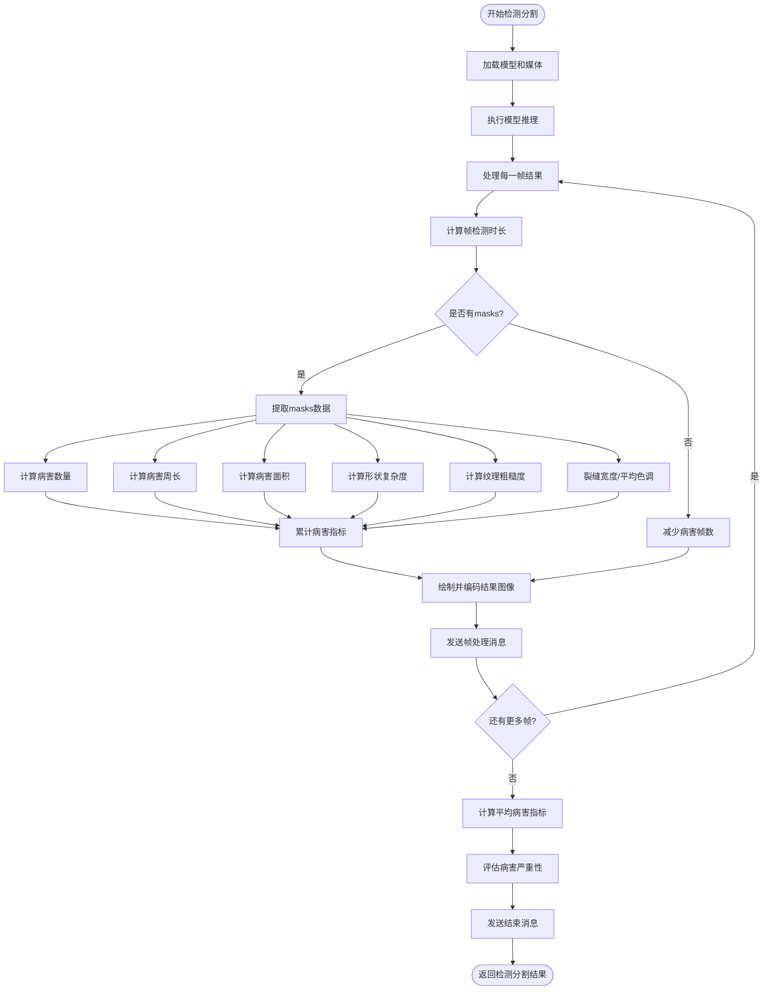

# 桥梁病害检测分割算法流程图

以下流程图展示了桥梁病害检测分割算法的核心流程，从加载模型和媒体开始，直至生成检测结果。

## 流程说明

1. **开始检测分割**：接收检测请求，获取模型 ID 和媒体 ID
2. **加载模型和媒体**：从数据库获取模型和媒体详情
3. **执行模型推理**：对媒体文件执行 YOLO 推理，启用流式处理
4. **处理每一帧结果**：逐帧处理 YOLO 推理结果
5. **计算帧检测时长**：记录每帧处理的耗时
6. **检查 masks**：判断当前帧是否检测到病害
7. **提取 masks 数据**：从检测结果中提取 masks 数据
8. **计算病害指标**：计算各种病害指标（数量、周长、面积等）
9. **累计病害指标**：累加各帧的病害指标
10. **绘制并编码图像**：生成标注后的图像并编码为 base64
11. **发送帧处理消息**：向客户端发送帧处理结果
12. **计算平均病害指标**：计算所有帧的平均病害指标
13. **评估病害严重性**：根据病害指标评估严重程度
14. **发送结束消息**：向客户端发送处理完成的消息
15. **返回检测结果**：将完整的检测结果返回给客户端